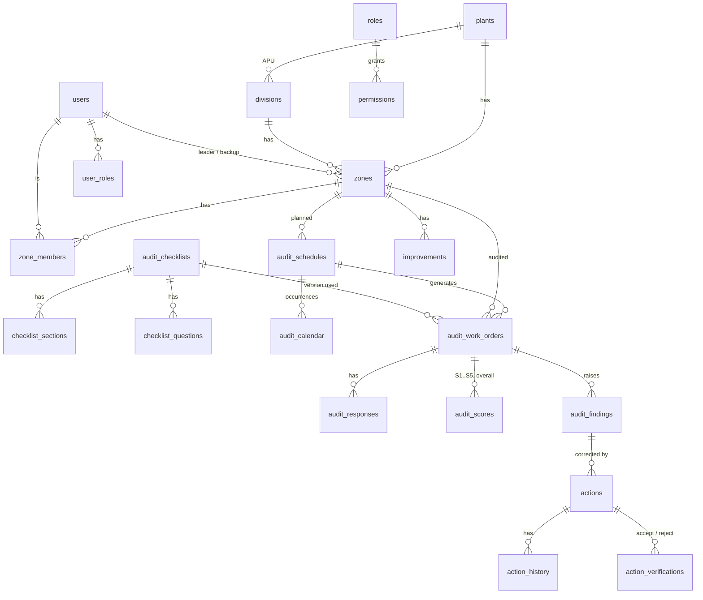

# Database design (PostgreSQL 14+)

`server/db/schema.sql` (idempotent). 37 tables, 43 foreign keys, 90+ indexes, 4 reporting views.
Principle (spec §64): every record keeps a link to its parent, so one query walks **Plant → APU → Zone → Schedule → Work order → Response/Score → Finding → Action → Verification**.

| Group | Tables |
|---|---|
| Configuration | `app_settings` (settings, masters JSON), `counters`, `s_categories`, `scoring_rules`, `notification_rules` |
| RBAC | `roles`, `permissions`, `users`, `user_roles`, `user_plants`, `user_divisions`, `auth_sessions` |
| Organisation | `plants`, `divisions` (APU), `departments`, `sections`, `areas`, `zones`, `zone_members` |
| 5S configuration | `audit_checklists` (versioned), `checklist_sections`, `checklist_questions` |
| Planning | `audit_schedules`, `audit_calendar` |
| Execution | `audit_work_orders`, `audit_responses`, `audit_scores`, `audit_findings`, `attachments` |
| Corrective actions | `actions`, `action_history`, `action_verifications`, `improvements` |
| Notifications | `notifications` (GIN index on recipients) |
| Audit trail | `audit_log_docs`, `audit_logs` (append-only trigger) |
| Sync | `tombstones`, sequence `change_seq` (revision stamp via trigger) |

Notable constraints: unique `(schedule_id, planned_date)` on work orders (no duplicate generation), unique work-order/finding/action numbers, status `CHECK`s, deferrable FKs for user references, `ON DELETE RESTRICT` between audit → finding → action so history cannot be orphaned.
Views: `v_latest_zone_score`, `v_monthly_apu_score` (APU ranking), `v_action_aging` (0–7 / 8–15 / 16–30 / 31–60 / 60+), `v_repeat_findings`.
Numbering is a single atomic `UPDATE counters ... RETURNING` per kind (AUD, FND, ACT, IMP, SCH); formats come from the numbering setting, e.g. `5S-AUD-2026-000125`.
